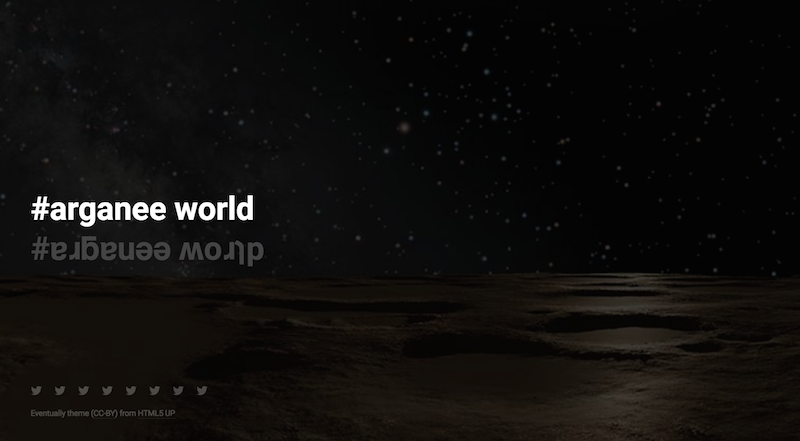

# Arganee Wordpress Theme

by Alan Levine https://cog.dog or http://cogdogblog.com/

-----
*If this kind of stuff has any value to you, please consider supporting me so I can do more!*

 

----- 

## What is it?

A Wordpress theme hacked out of the [HTML5up Eventually Theme](http://html5up.net/) used for http://arganee.world

This was done following [envato tuts+ Creating a WordPress Theme From Static HTML: Preparing the Markup](https://code.tutsplus.com/tutorials/creating-a-wordpress-theme-from-static-html-preparing-the-markup--wp-33895) The dynamic content is generated from the titles of "posts" using the Wordpress API to load via JavaScript (thanks to a hand from [Tom Woodward](http://bionicteaching.com/).

More details here [Hacking a WordPress Theme from HTML5up Template with some API goodies](https://cogdogblog.com/2017/01/wp-theme-html5up-template/)

## Ch-ch-ch-changes

* Feb 28, 2021 - Footer clean up, ought to make menus soon WordPress driven rather than hard coded into footer, also consider a means to contribute new quotes in SPLOT like fashion.
* Feb 1, 2021 - fixed heading typo and set up better CSS to anchor footer in bottom
* Jan 17, 2017 - first slapped together and sent into orbit

